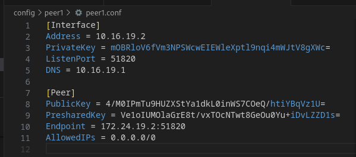

# wireguard docker sample

this repository provide docker compose samples to
use wireguard image as server and client 
in difference to regular use cases,
the setup build secure tunnel between containers only.

+ [wireguard image](https://hub.docker.com/r/linuxserver/wireguard#!) thanks to [linuxserver.io](https://hub.docker.com/u/linuxserver)
+ [github repo](https://github.com/linuxserver/docker-wireguard/blob/master/README.md)

documentation is fine, to implement my use case
took several hours of digging and many attempts.
maybe it helps someone else. 

## compose

edit [yaml](wg-compose.yaml) to fit your preferences.

use `id <your user name>` to find values for `PUID` and `PGID`.

```shell
id <your user name>
```

at first run start just wireguard server, 
to build configuration files stored in volumne `./config`.

```shell
docker-compose -f wg-compose.yaml up -d wg-s1
```

now folder `config` has been created

please edit [peer1.conf](./config/peer1/peer1.conf)

in section `[Peer]` set `Endpoint` to IP address of service `wg-s1`.



`Endpoint = 172.24.19.2:51820`

to have matching compose yaml and documentation static
IP addresses have been assigned to network `wgn-secured` and
to services, 
let me know in case you have a better way.


:bulp: 
be aware changing environment variables (SERVERPORT, PEERS, PEERDNS, INTERNAL_SUBNET, ALLOWEDIPS) will trigger 
rebuild of configuration files 

```shell
docker-compose -f wg-compose.yaml up -d wg-c1
```

using #vscode and docker extension,
simple `Attach shell` on service `wg-c1`

and ping wireguard server

```shell
ping 10.16.19.1
```


using #vscode and docker extension,
simple `Attach shell` on service `wg-s1`


and ping wireguard peer 1

```shell
ping 10.16.19.2
```


use `wg show` to view wireguard tunnel.

```shell
wg show
```


```shell
docker-compose -f wg-compose.yaml up -d
```

```shell
docker-compose -f wg-compose.yaml down
```

## useful commands

```shell
wg show
```

```shell
ifconfig
```

```shell
ping 10.16.19.1
ping 10.16.19.2
ping 172.24.19.2
ping 172.24.19.3
```

```shell
ip route show
```

```shell
ip route add ...
```

https://github.com/linuxserver/docker-wireguard/issues/139

```shell
iptables -L -v
```

```shell
date +"%Z %z"
```

```shell
timedatectl list-timezones
```


## wirehark useful addons

in case you want to wireshark container network,
following repositories might interest you

+ [EdgeShark](https://github.com/siemens/edgeshark)
+ [cshargextcap](https://github.com/siemens/cshargextcap)
+ [ghostWire](https://github.com/siemens/ghostwire)
  `docker compose up -d`
+ [PacketFix](https://github.com/siemens/packetflix)
+ [ghostWire](https://github.com/siemens/ghostwire)


## digging links

+ https://github.com/linuxserver/docker-wireguard/blob/master/README.md
+ https://hub.docker.com/r/linuxserver/wireguard#!
+ https://www.linuxserver.io/blog/advanced-wireguard-container-routing
+ https://www.linuxserver.io/blog/advanced-wireguard-hub
+ https://linuxize.com/post/how-to-set-up-wireguard-vpn-on-centos-8/
+ https://github.com/linuxserver/docker-wireguard
+ https://linuxiac.com/how-to-set-up-wireguard-vpn-with-docker/ 
+ https://www.smarthomebeginner.com/wireguard-docker-compose-guide-2023/
  + https://www.smarthomebeginner.com/wireguard-vpn-for-beginners/
  + https://www.smarthomebeginner.com/linux-wireguard-vpn-server-setup/
  + https://www.smarthomebeginner.com/wireguard-docker-compose-guide-2023/
+ https://docs.docker.com/samples/wireguard/
+ https://www.linuxserver.io/blog/routing-docker-host-and-container-traffic-through-wireguard
+ https://docs.techdox.nz/wireguard/#docker-compose-file-docker-composeyml
+ https://docs.linuxserver.io/images/docker-wireguard/
+ https://hub.docker.com/r/linuxserver/wireguard#!
+ https://codeopolis.com/posts/installing-wireguard-in-docker/

